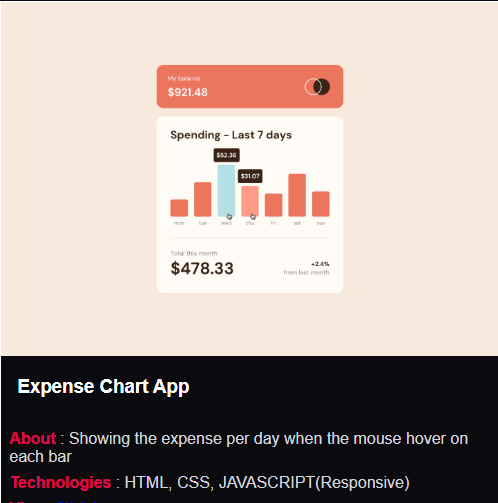
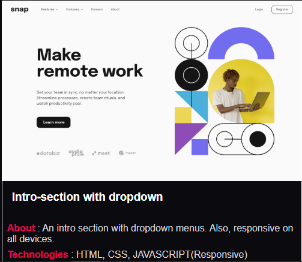
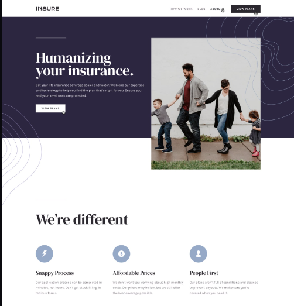

# JABS PORTFOLIO

Welcome to my personal portfolio website — a modern, responsive, and stylish platform to showcase my skills, projects, and experiences.

## 🌐 Live Demo

Access the portfolio live at: [https://jabs081.github.io/JABS-PORTFOLIO/](https://jabs081.github.io/JABS-PORTFOLIO/)

## 📸 Screenshots

Here are some previews of the website:

- 
- 
- 

## 🛠️ Technologies Used

- **React** – Component-based UI library
- **JavaScript (ES6+)** – Language of the web
- **CSS3** – For responsive layouts and styling
- **GitHub Pages** – Hosting platform

## 🚀 Features

- Responsive design across devices
- Theme selection (color variants)
- Project and resume showcase
- Contact form integration
- Interactive stats and animations

## 📦 Installation & Setup

To run this project locally:

```bash
git clone https://github.com/jabs081/JABS-PORTFOLIO.git
cd JABS-PORTFOLIO
npm install
npm run dev
```

## 🚢 Deployment

This project is set up to deploy using **GitHub Pages**. To deploy:

```bash
npm run build
# Push the build to your gh-pages branch or configure GitHub Actions
```

Ensure your `homepage` field in `package.json` is:

```json
"homepage": "https://jabs081.github.io/JABS-PORTFOLIO"
```

## 👥 Contributing

Pull requests are welcome. For major changes, open an issue first to discuss what you would like to change.

---

Made with ❤️ by **jabs081**
